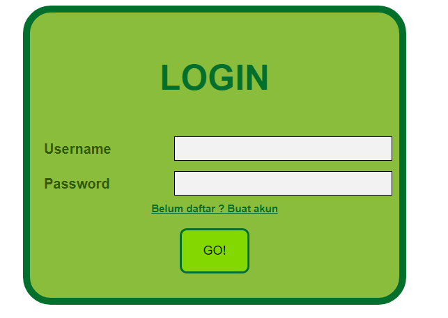
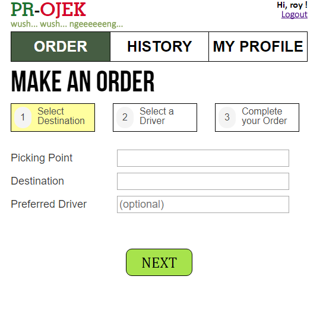
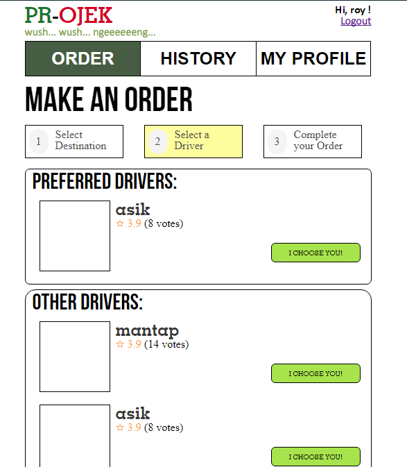
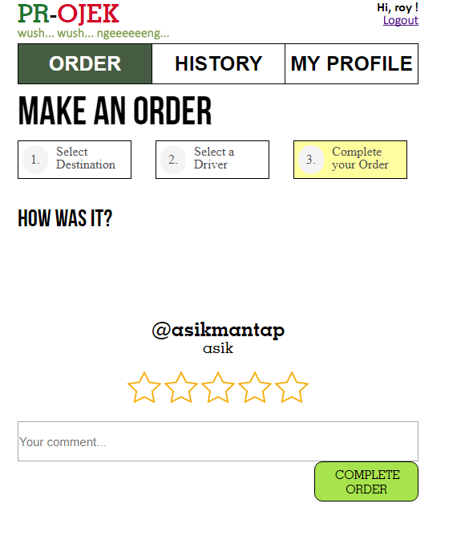
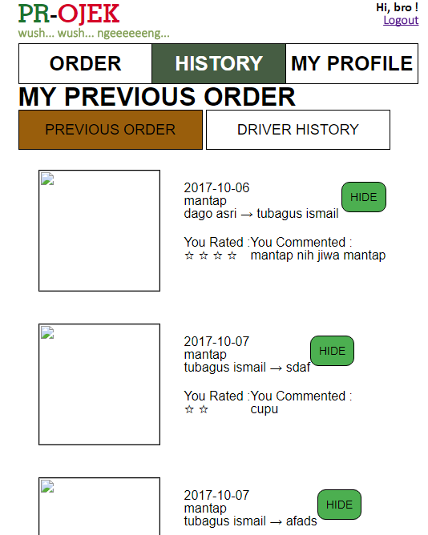

# **Tugas 1 IF3110 Pengembangan Aplikasi Berbasis Web**

# Tim Spidey

`13515012 | Rio Dwi Putra`
`13515090 | Annisa Muzdalifa`
`13515123 | Royyan Abdullah Dzakiy`

# Penjelasan Web

Pada tugas besar kali ini, kami membuat aplikasi *ojek online* **berbasis web** yang memungkinkan seorang pengguna untuk menjadi penumpang dan/atau driver ojek online. Untuk menggunakan aplikasi ini, seorang pengguna harus melakukan login. Pengguna dapat menjadi penumpang maupun driver pada akun yang sama. Untuk menjadi driver, pengguna harus mengaktifkan opsi menjadi driver pada profilnya.

# Tampilan Aplikasi

*tampilan login*

*tampilan register*

*tampilan profile*

*tampilan edit-profile*

*tampilan edit-preferred location*

*tampilan order 1: select destination*

*tampilan order 2: select driver*

*tampilan order 3: complete order*

*tampilan history order*

*tampilan order drive*

# Pembagian Tugas

Berikut adalah pembagian tugas yang dilakukan

## Tampilan

1. Login : 13515012

2. Register : 13515012

3. Profile : 13515090

4. Edit-profile : 13515090

5. Edit-preffered Location : 13515090

6. order 1 : 13515123

7. order 2 : 13515123

8. order 3 : 13515123

9. history 1 : 13515012

10. history 2 : 13515012

## Fungsionalitas

1. Login : 13515012

2. Register : 13515012, 13515123

3. Profile : 13515090

4. Edit-profile : 13515090

5. Edit-preffered Location : 13515090

6. order 1 : 13515123

7. order 2 : 13515123

8. order 3 : 13515123

9. history 1 : 13515012, 13515123

10. history 2 : 13515012

## About

Mahasiswa IF3110 2017

Rio | Amuz | Royyan

Dosen : Yudistira Dwi Wardhana | Riza Satria Perdana | Muhammad Zuhri Catur Candra

